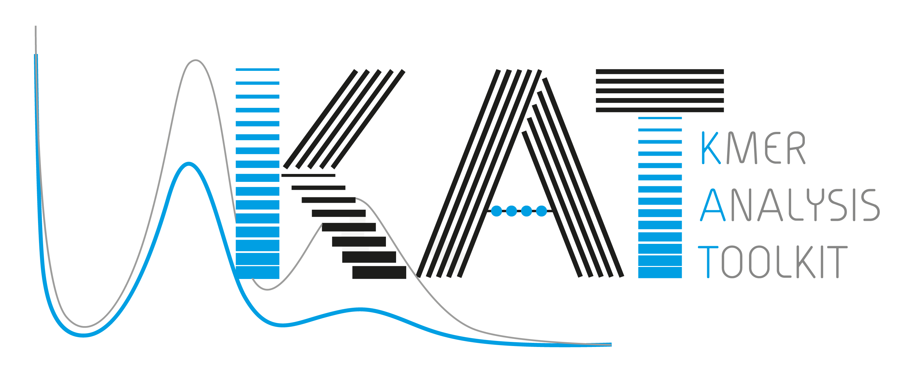

KAT - The K-mer Analysis Toolkit
================================

KAT is a suite of tools that analyse jellyfish hashes or sequence files (fasta or fastq) using kmer counts.  The following tools are currently available in KAT:

   - **hist**:   Create an histogram of k-mer occurrences from a sequence file.  Adds metadata in output for easy plotting.
   - **gcp:**    K-mer GC Processor.  Creates a matrix of the number of K-mers found given a GC count and a K-mer count.
   - **comp**:   K-mer comparison tool.  Creates a matrix of shared K-mers between two (or three) sequence files or hashes.
   - **sect**:   SEquence Coverage estimator Tool.  Estimates the coverage of each sequence in a file using K-mers from another sequence file.
   - **blob**:   Given, reads and an assembly, calculates both the read and assembly K-mer coverage along with GC% for each sequence in the assembly.SEquence Coverage estimator Tool.
   - **filter**: Filtering tools.  Contains tools for filtering k-mer hashes and FastQ/A files:
     - **kmer**:         Produces a k-mer hash containing only k-mers within specified coverage and GC tolerances.
     - **seq**:          Filters a sequence file based on whether or not the sequences contain k-mers within a provided hash.
   - **plot**:   Plotting tools.  Contains several plotting tools to visualise K-mer and compare distributions. The following plot tools are available:
     - **density**:      Creates a density plot from a matrix created with the "comp" tool.  Typically this is used to compare two K-mer hashes produced by different NGS reads.
     - **profile**:      Creates a K-mer coverage plot for a single sequence.  Takes in fasta coverage output coverage from the "sect" tool
     - **spectra-cn**:   Creates a stacked histogram using a matrix created with the "comp" tool.  Typically this is used to compare a jellyfish hash produced from a read set to a jellyfish hash produced from an assembly. The plot shows the amount of distinct K-mers absent, as well as the copy number variation present within the assembly.
     - **spectra-hist**: Creates a K-mer spectra plot for a set of K-mer histograms produced either by jellyfish-histo or kat-histo.
     - **spectra-mx**:   Creates a K-mer spectra plot for a set of K-mer histograms that are derived from selected rows or columns in a matrix produced by the "comp".

In addition, KAT contains a python script for analysing the mathematical distributions present in the K-mer spectra in order to determine how much content is present in each peak.

This README only contains some brief details of how to install and use KAT.  For more
extensive documentation please visit: https://kat.readthedocs.org/en/latest/


Installation
------------

To install KAT first confirm these dependencies are installed and configured on your system:

  - **GCC** V4.8+
  - **make**
  - **autoconf** V2.53+
  - **automake** V1.11+
  - **libtool** V2.4.2+
  - **pthreads** (probably already installed)
  - **zlib**
  - **Python** V3.5+ with the *tabulate*, *scipy*, *numpy* and *matplotlib* packages and C API installed.  Python is optional but highly recommended, without python, KAT functionality is limited: no plots, no distribution analysis, and no documentation.
  - **Sphinx-doc** V1.3+ (Optional: only required for building the documentation.  

NOTE ON INSTALLING PYTHON: Many system python installations do not come with the C API immediately available, which prevents KAT from embedding python code.  We typically would recommend installing anaconda3 as this would include the latest version of python, all required python packages as well as the C API.  If you are running a debian system and the C libraries are not available by default and you wish to use the system python installation the you can install them using: ```sudo apt-get install python-dev```.  

Then proceed with the following steps:

  - Clone the git repository (For ssh: ```git clone git@github.com:TGAC/KAT.git```; or for https: ```git clone https://github.com/TGAC/KAT.git```), into a directory on your machine.
  - Change directory into KAT project: ```cd KAT```
  - Build boost (this may take some time): ```./build_boost.sh```
  - Setup the KAT configuration scripts by typing: ```./autogen.sh```.
  - Generate makefiles and confirm dependencies: ```./configure```. The configure script can take several options as arguments.  One commonly modified option is ```--prefix```, which will install KAT to a custom directory.  By default this is ```/usr/local```, so the KAT executable would be found at ```/usr/local/bin``` by default. Python functionality can be disabled using ```--disable-pykat```.  Type ```./configure --help``` for full list of options.  Please check the output to ensure the configuration is setup as you'd expect.
  - Compile software: ```make```.  You can leverage extra cores duing the compilation process using the ```-j <#cores>``` option.  Also you can see all command lines used to build the software by setting ```V=1```.
  - Run tests (optional) ```make check```.  (The ```-j``` and ```V=1``` options described above are also supported here.)
  - Install: ```make install```.  If you've not provided a specific installation directory, you will likely need to prefix this command with ```sudo``` in order to provide the permissions required to install to ```/usr/local```.

If sphinx is installed and detected on your system then html documentation and man
pages are automatically built during the build process.  If it is not detected then this step is skipped.  Should you wish to create a PDF version of the manual you can do so by entering the ```doc``` directory and typing ```make pdf```, this is not executed by default.  

NOTE: if KAT is failing at the ```./autogen.sh``` step you will likely need to install autotools.  The following command should do this on MacOS: ```brew install autoconf automake libtool```.  On a debian system this can be done with: ```sudo apt-get install autoconf automake libtool```.


*Python scripts*

KAT will install some python scripts to your ```<prefix>/bin``` directory.  If you selected a custom location for prefix and wish to access these scripts directly, then it may be necessary to modify your $PYTHONPATH environment variable.  Ensure that ```<prefix>/lib/python<version>/site-packages```, is on your PYTHONPATH, where <version> represents the python version to used when installing KAT e.g. ```/home/me/kat/lib/python3.6/site-packages```.  Alternatively, you could install the kat python package into a python environment by changing into the ```scripts``` directory and typing ```python setup.py install```. 


Operating Instructions
----------------------

After KAT has been installed, the ```kat``` executable file should be available which contains a number of subtools.

Running ```kat --help``` will bring up a list of available tools within kat.  To get help on any of these subtools simple type: ```kat <tool> --help```.  For example: ```kat sect --help``` will show details on how to use the sequence coverage estimator tool.

KAT supports file globbing for input, this is particularly useful when trying to count and analyse kmers for paired end files.  For example,
assuming you had two files: LIB_R1.fastq, LIB_R2.fastq in the current directory then ```kat hist -C -m27 LIB_R?.fastq```, will consume any
files matching the pattern LIB_R?.fastq as input, i.e. LIB_R1.fastq, LIB_R2.fastq.  The same result could be achieved listing the files at
the command line: ```kat hist -C -m27 LIB_R1.fastq LIB_R2.fastq```

Note, the KAT comp subtool takes 2 or three groups of inputs as positional arguments therefore we need to distinguish between the file groups.
This is achieved by surrounding any glob patterns or file lists in single quotes.  For example, assuming we have LIB1_R1.fastq, LIB1_R2.fastq,
LIB2_R1.fastq, LIB2_R2.fastq in the current directory, and we want to compare LIB1 against LIB2, instead of catting the files together, we might
run either: ```kat comp -C -D 'LIB1_R?.fastq' 'LIB2_R?.fastq'```; or ```kat comp -C -D 'LIB1_R1.fastq LIB1_R2.fastq' 'LIB2_R1.fastq LIB2_R2.fastq'```.
Both commands do the same thing.


Licensing
---------


GNU GPL V3.  See COPYING file for more details.

Cite
----

If you use KAT in your work and wish to cite us please use the following citation:

Daniel Mapleson, Gonzalo Garcia Accinelli, George Kettleborough, Jonathan Wright, and Bernardo J. Clavijo.
**KAT: A K-mer Analysis Toolkit to quality control NGS datasets and genome assemblies.**
Bioinformatics, 2016. [doi: 10.1093/bioinformatics/btw663](http://bioinformatics.oxfordjournals.org/content/early/2016/10/20/bioinformatics.btw663.abstract)


Authors
-------

* Daniel Mapleson (The software architect and developer)
* Gonzalo Garcia (KAT superuser and primary tester)
* George Kettleborough (For the recent python plotting functionality)
* Jon Wright (KAT superuser and documentation writer)
* Bernardo Clavijo (KAT's godfather, evangelist and all-round k-mer guru)

See AUTHORS file for more details.


Acknowledgements
----------------

 * Affiliation: Earlham Institute (EI)
 * Funding: The Biotechnology and Biological Sciences Research Council (BBSRC)

We would also like to thank the authors of Jellyfish: https://github.com/gmarcais/Jellyfish;
and SeqAn: http://www.seqan.de/.  Both are embedded inside KAT.
