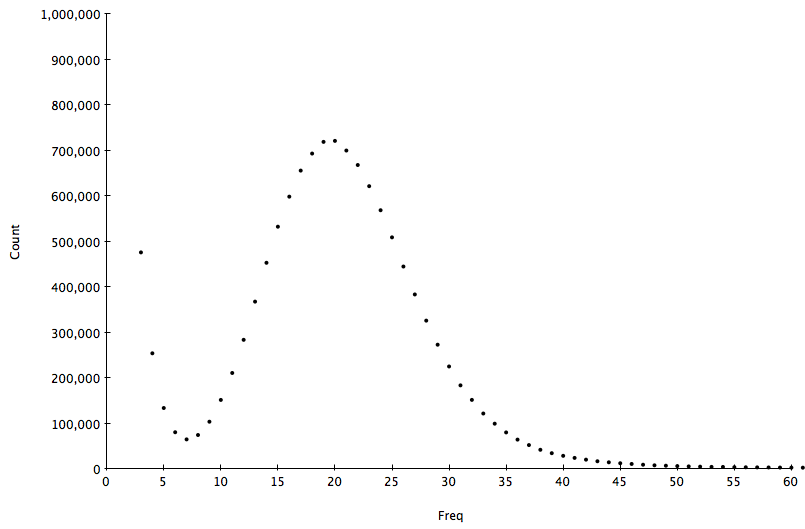
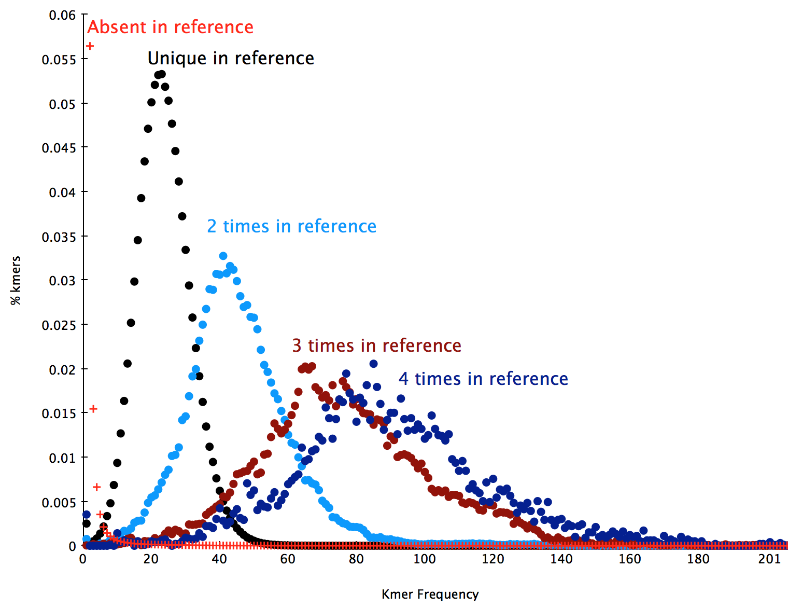

.. _kmer:

K-mer spectra
=============

A K-mer spectra is a graphical representation of a dataset showing how many short
fixed length words (k-mers) appear a certain number of times.  The frequency of 
occurance is plotted on the x-axis and the number of k-mers on the y-axis.  The 
k-mer spectra is composed of distributions representing groups of motifs at different 
frequencies in the sample, plus biases. Given not too many biases, the shape of the 
distributions provides a useful set of properties describing the biological sample, 
the sequencing process and the amount of useful data in the dataset.

A typical 31-mer spectrum of S.cerevisae S288C WGS dataset is shown in the
following figure:

    

This is composed of an error component containing a huge amount of rare motifs at 
frequency < 7 arising from errors in the sequencing process, and a several other 
components as distributions with different modes according to how many times a motif 
appears on the genome (once, twice, three times etc.). The following plot shows the 
decomposition of this distribution into it's component distributions:

