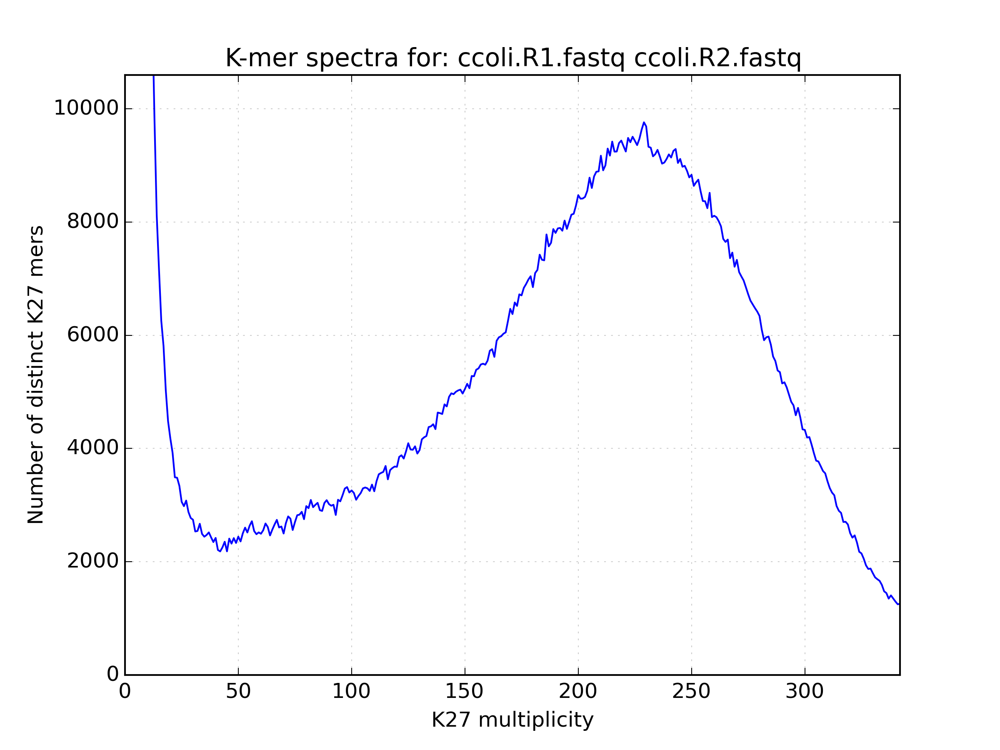
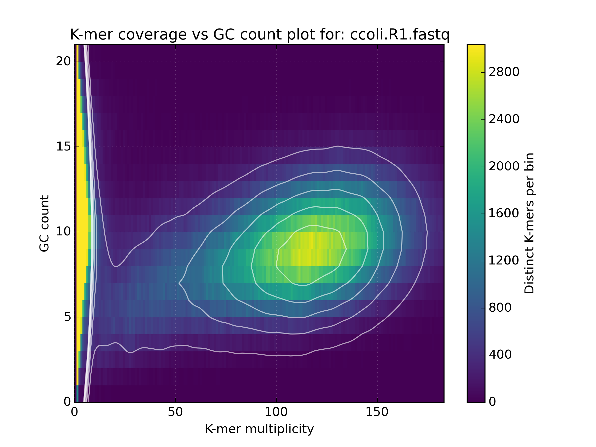
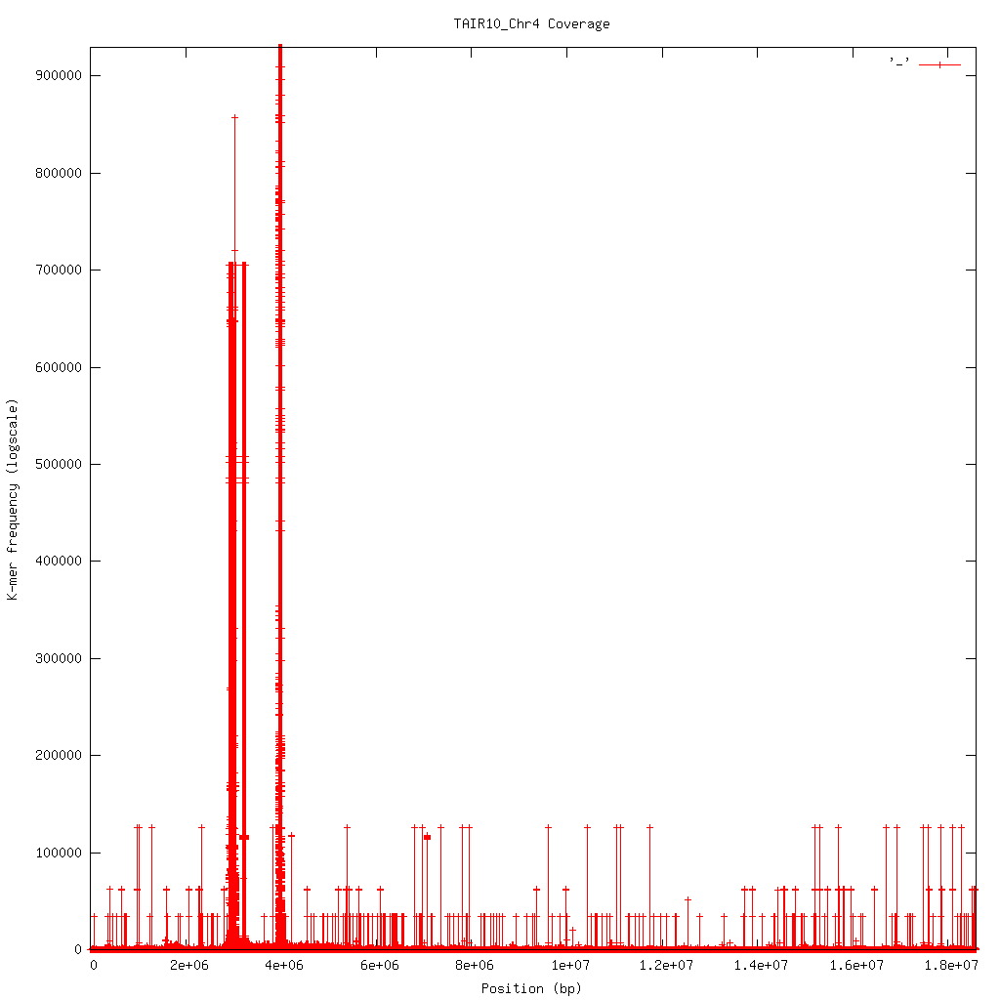
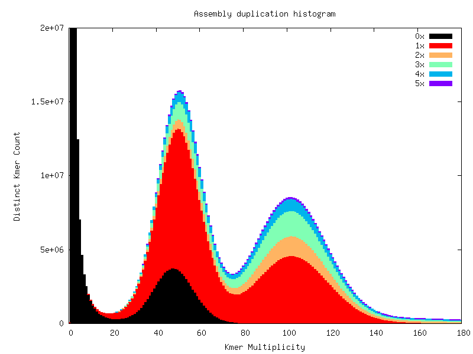
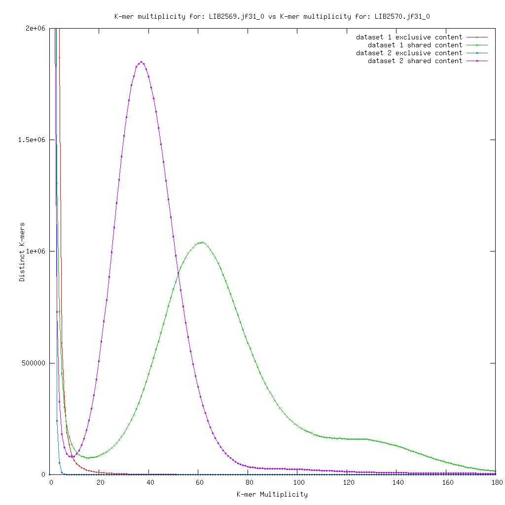

.. _using:

Using KAT
=========

KAT is a C++ program containing a number of subtools which can be used in
isolation or as part of a pipeline.  Typing ``kat --help`` will show a
list of the available subtools.  Each subtool has its own help system which you 
can access by typing ``kat <subtool> --help``.

HIST
----

Creates a histogram with the number of distinct k-mers having a given frequency, 
derived from the input. The input can take the form of one or more FastA or FastQ 
files, or a jellyfish hash.  The last bucket in the histogram behaves as a catchall: 
it tallies all k-mers with a count greater or equal to the low end point of this bucket. 

This tool is very similar to the ``histo`` tool in jellyfish itself.  The primary 
difference being that the output contains metadata that make the histogram easier 
for the user to plot, and that this version is faster because we do not need to 
dump the hash to disk and read it back.

Basic usage:: 

    kat hist [options] (<input>)+

Output:

Produces a histogram file and associated `Spectra hist`_ plot.
The histogram file starts with a header describing settings used to generate the
histogram.  Each header line starts with a '#' character.  The histogram that follows
describes each K-mer frequency followed by the number of distinct K-mers found
at that frequency separated by a space.  Each frequency / count pair is line separated.
For example::

    # Title:27-mer spectra for: SRR519624_1.1M.fastq
    # XLabel:27-mer frequency
    # YLabel:# distinct 27-mers
    # Kmer value:27
    # Input 1:SRR519624_1.1M.fastq
    ###
    1 47573743
    2 4737789
    3 732453
    4 184505
    5 100293
    6 78699
    7 68553
    8 59589
    9 50926
    ...

Applications:

 * Assess data quality: estimates of kmers deriving from errors; sequencing bias
 * Determine completeness of sequencing
 * Identify genomic properties: Heterozygosity, homozygosity, karyotype, repeat content.
 * Limited contamination detection

GCP
---

This tool takes in either a single jellyfish hash or one or more FastA or FastQ 
input files and then counts the GC nucleotides for each distinct K-mer in the hash.  
For each GC count and K-mer coverage level, the number of distinct K-mers are counted 
and stored in a matrix.  This matrix can be used in much that same way as a kmer
spectra histogram, although it provides richer output by incorperating GC content
into the picture.  This helps to distinguish legitimate content from contamination, 
which often appear as separate spots at unexpected GC and coverage levels.

Basic usage::

    kat gcp (<input>)+

Output:

Produces a matrix file and associated `Density`_ plot. The matrix file starts with 
a header describing settings used to generate the matrix.  Each header line starts 
with a '#' character.  The matrix that follows contains a space separated list of
distinct k-mer counts for the GC-count indexed by the row.  Each column index represents
the K-mer Frequency. For example::

    # Title:K-mer coverage vs GC count plot for: ERR409722_1.fastq ERR409722_2.fastq 
    # XLabel:K-mer multiplicity
    # YLabel:GC count
    # ZLabel:Distinct K-mers per bin
    # Columns:1001
    # Rows:27
    # MaxVal:7705834
    # Transpose:0
    ###
    0 65392 10715 6038 4615 3769 3140 2690 2133 1748 1519 1370 1098 840 ...
    0 189337 30772 20040 16630 15579 13673 12809 11890 10380 9605 8403 7370 6302 ...
    0 428150 66753 41453 37478 34599 34622 34572 32740 31487 30356 28369 26880 ...
    ...

Applications:

 * Assess data quality: estimates of kmers deriving from errors; sequencing bias
 * Determine completeness of sequencing
 * Identify genomic properties: Heterozygosity, homozygosity, karyotype, repeat content.
 * Contamination detection

Comp
----

Compares jellyfish K-mer count hashes.

The most common use case for this tool is to compare two (or three) K-mer hashes.  
The typical use case for this tool is to compare K-mers from two K-mer hashes 
both representing K-mer counts for reads.  However, it is also common to compare 
K-mers generated from reads to those generated from an assembly. If comparing 
K-mers from reads to K-mers from an assembly, the larger (most likely the read) 
K-mer hash should be provided first, then the assembly second. The third 
optional input acts as a filter, restricting the analysis to the K-mers present 
on that set.  The manual contains more details on specific use cases.

Basic usage::

    kat comp [options] <input_1> <input_2> [<input_3>]

Should the user wish to group multiple files to be concatenated into a single input 
group they may do so by surrounding the input group in single quotes.  The following
example groups the full input read set into the first input and compares against
an assembly::

    kat comp -t 8 -o pe_v_asm_test 'PE1.R1.fq PE1.R2.fq' asm.fa

... or more compactly::

    kat comp -t 8 -o pe_v_asm_test 'PE1.R?.fq' asm.fa

... or if the reads are gzipped::
    
    kat comp -t 8 -o pe_v_asm_test <(gunzip -c 'PE1.R?.fq') asm.fa

Output:

Produces a matrix file and by default a `Spectra CN`_ plot, although can also produce
a `Density` plot if requested. The matrix file is structured in a similar way to the
GCP tool with a header describing settings used to generate the matrix.  Each header line starts 
with a '#' character.  The matrix that follows contains a space separated list of
distinct k-mer counts for the frequency in each input file represented by the row 
and column index. For example::

    # Title:K-mer comparison plot
    # XLabel:K-mer multiplicity for: ERR409722_1.fastq
    # YLabel:K-mer multiplicity for: ERR409722_2.fastq
    # ZLabel:Distinct K-mers per bin
    # Columns:1001
    # Rows:1001
    # MaxVal:57106148
    # Transpose:1
    ###
    0 57106148 2133673 428934 134189 45267 16399 6603 3374 2066 1371 930 752 490 ...
    50919938 10364720 1613532 607932 239439 89985 36398 16589 8811 5469 3369 ...
    1990321 1605550 1061952 561999 271443 125163 61769 34379 22459 15647 11171 ...
    ...

Applications:

 * Determine sequencing bias between left and right read pairs.
 * Compare the kmer spectrum of input reads against an assembly to gauge assembly completeness.

SECT
----

Estimates coverage levels across sequences in the provided input sequence file.
This tool will produce a FastA style representation of the input sequence file 
containing K-mer coverage counts mapped across each sequence.  K-mer coverage is 
determined from the provided counts input file, which can be either one jellyfish 
hash, or one or more FastA / FastQ files.  In addition, a space separated table 
file containing the mean coverage score and GC of each sequence is produced.  The 
row order is identical to the original sequence file.

NOTE: K-mers containing any Ns derived from sequences in the sequence file not be 
included.

Basic usage::

    kat sect [options] <sequence_file> (<input>)+

Output:

Produces a FastA-style representation of the K-mer frequency across each target sequence
as well as a file describing statistics for each target sequence.  The FastA-style
output might look like this::

    >Chr4
    31 31 31 29 29 29 28 27 27 28 28 28 30 30 30 29 29 29 29 31 32 32 33 33 33 31 29 30 ...

With an associated tab separated stats file which looks like this::

    seq_name median       mean      gc%  seq_length  invalid_kmers  %_invalid  non_zero_bases  %_non_zero  %_non_zero_corrected
    Chr4         26  362.45141  0.36204    18585056           3214    0.01729        18549840    99.81065              99.82792

The column headers have the following meaning:
 * seq_name - The name of the FastA/Q sequence
 * median - The median K-mer coverage across the sequence
 * mean - The mean K-mer coverage across the sequence
 * gc% - The GC% of the sequence
 * seq_length - The length of the sequence
 * invalid_kmers - The number of K-mers in the sequence that cannot be counted, most likely due to being non-canonical.  i.e. non A,T,G,C
 * %_invalid - The percentage of the sequence which contains invalid K-mers
 * non_zero_kmers - The number of K-mers that have a coverage of 1 or greater
 * %_non_zero - The percentage of the sequence which has a K-mer coverage greater than 1
 * %_non_zero_corrected - The percentage of the sequence which has a K-mer coverage greater than 1 but ignoring any parts of the sequence represented by invalid K-mers.

Applications:

 * Analyse K-mer coverage across assembled sequences
 * Compare assemblies using K-mers, helpful to levels of contamination of a specific organism.
 * Contamination detection - Compare K-mer spectrum against assembly providing average coverage and GC values for each contig, which can be 2D binned and plot as a heatmap

Filtering tools
---------------

KAT comes with two filtering tools allowing the user to slice and dice their data
in a rapid and simple way.

K-mer filtering
~~~~~~~~~~~~~~~

This tool allows the user to produce K-mer hashes, within and outside user defined 
GC and k-mer coverage bounds. This is useful for isolating k-mers that could be 
attributable to contamination, or for contamination removal.  Normally, the user 
would identify such regions using plots from the GCP tool.

Basic usage::

    kat filter kmer [options] (<input>)+

Applications:

 * Extracting k-mers with defined GC and coverage
 * Contamination extraction (from k-mer hash)

Sequence filtering
~~~~~~~~~~~~~~~~~~

The user loads a k-mer hash and then filters sequences (either in or out) depending 
on whether those sequences contain the k-mer or not.  The user can also apply a 
threshold requiring X% of k-mers to be in the sequence before filtering is applied.
The user can also use this tool for filtering paired end reads, and for subsampling.

Basic usage::

    kat filter seq [options] --seq <seq_file> <k-mer_hash>

Applications:

 * Contamination extraction from read file or assembly files, extraction of organelles, subsampling high_coverage regions

Plotting tools
--------------

KAT comes with a selection of plotting tools for representing and comparing
K-mer spectra in various ways.  All plotting tools come with the ability to manually
modify axis, titles, limits, size, resolution, etc, although they will all try to pick 
intelligent defaults directly from the data provided.  

Spectra hist
~~~~~~~~~~~~

Visualises the K-mer spectra from ``kat hist`` or ``jellyfish histo`` output.  
This tool is designed to plot line graphs of one or more histograms.  The idea is 
to be able to compare total K-mer counts between different datasets.

Basic usage::

    kat plot spectra-hist <hist_file>

Applications:

 * Basic K-mer spectra visualisation

Density
~~~~~~~

Creates a scatter plot, where the density or "heat" at each point represents the 
number of distinct K-mers at that point.  Typically this is used to visualise a 
matrix produced by the ``kat comp`` tool to compare frequencies from two K-mer 
hashes produced by different NGS reads, or to visualise the GC vs K-mer matrices 
produced by the ``kat gcp`` tool.

Basic usage::

    kat plot density <matrix_file>

Applications:

 * Visualise GC vs coverage matrices
 * Visualise coverage vs coverage matrices

.. image:: images/ccoli_comp.png
    :scale: 25%

Profile
~~~~~~~

Shows K-mer coverage level across an sequence

Basic usage::

    kat plot profile <sect_counts_file>

Applications:

 * Visualise coverage (and optionally GC) levels across a sequence or set of sequences

Spectra CN
~~~~~~~~~~

Shows K-mer duplication levels, which correspond to copy number variation within 
an assembly by comparing K-mers found in sequenced reads, to K-mers found in an 
assembly of those reads. Uses matrix output from the ``kat comp`` tool.

Basic usage::

    kat plot spectra-cn <matrix_file>

Applications:

 * Visualise the copy number spectra of WGS data compared against an assembly

Spectra MX
~~~~~~~~~~

Produces K-mer spectras from rows or columns in a matrix generated by ``kat comp``.  
This tool is designed to plot line graphs for one or more histograms, each histogram 
being represented by a single row or column in the matrix.

This tool also has a special mode for showing shared and exclusive content between 
two different samples. This mode takes the first row and column of the matrix representing 
content which is found exclusively in each sample.  Two more lines are plotting, 
one which has each following row summed, and the other that has each following column 
summed.  These two plots represent the shared content for each sample.  This mode 
can be activated using the ``--intersection`` flag.

Alternatively, you can select specific rows and columns from the matrix using a 
comma separated list identified with the ``--list`` option.  Each element in the 
list should start with either a 'c' or a 'r' indicating whether or not the column 
or row is requested.  Then the element should contain a number indicating which 
column or row to select.  For example: ``--list c0,r1`` will select column 0 and 
row 1. Note: spaces are not tolerated in this list.

Basic usage::

    kat plot spectra-mx <matrix_file>

Applications:

 * Visualising shared and exclusive content between two datasets
 * RNAseq to WGS comparison
 * Visualising k-mer spectra of arbitrary columns and rows from a matrix

